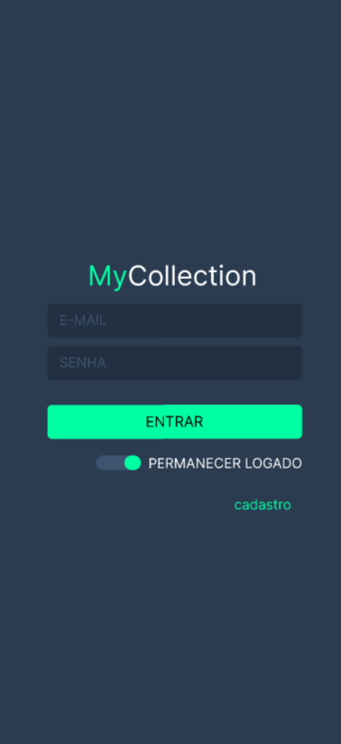
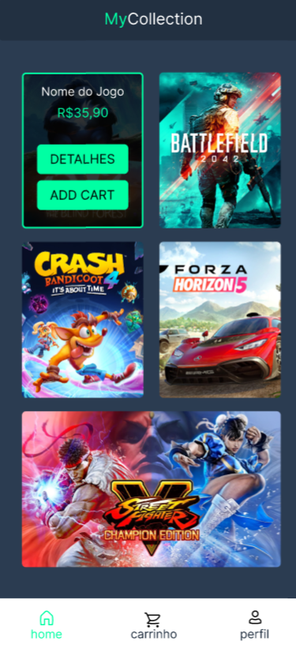
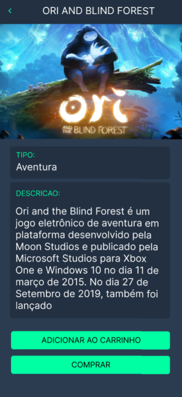

<h1 align="center">
<br>
  
<br>
<br>
</h1>

<p align="center">
  
  
   
  
  
</p>

<!-- What is: -->

## What is My Collection ?
 
My Collection is an app aimed at fans of the most beloved games
of world, with it you can buy to all your games favorite, know details of game, look your history boughts and more.

<!-- Tecnologics: -->

## Technologies Used?

- **React-native:** - Framework used in application development.
- **Expo:** - Tool used in application development.
- **Axios:** Http client based on promises for connection with api.
- **yarn:** Library of manager of packages.

<!-- Links: -->

## Links

**React-native:** (https://facebook.github.io/react-native/)

- **Expo:** (https://expo.dev/)
- **Axios:** (https://github.com/axios/axios)
- **Eslint:** (https://eslint.org/)
- **yarn:** (https://yarnpkg.com/)

---

<!-- Get Started / Install: -->

## Getting started

Prerequisites: To run the react-native project on your mobile or emulator you need some
more specific settings, I recommend this link
(https://facebook.github.io/react-native/docs/getting-started) if you do not already have the recommended settings on your machine.

1. Install
   [Git](http://git-scm.com/downloads) e
   [NodeJS](http://nodejs.org/download/),
   in case you don't have them yet.

2. Clone repository:

   ```sh
   $ git clone git://github.com/hyankelwin/my-collection-app.git
   ```

3. Go to project folder:

   ```sh
   $ cd MyCollection
   ```

4. Install all dependences:

   ```sh
   $ npm install ou yarn
   ```

5. Finally run:

   ```sh

   $ expo start (Android)
 
   ```

   Now you will see the app running on your mobile phone or emulator :D

<!-- Create by: -->

## Who's behind this?

Created in class taught by [Michel Kuguio](https://github.com/misaku).
